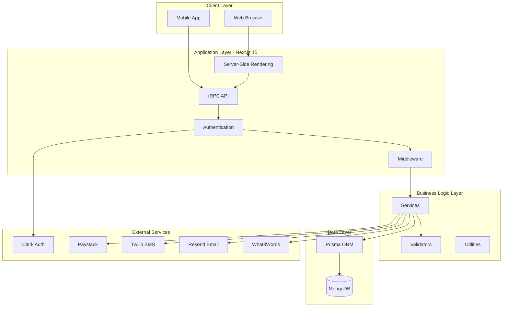
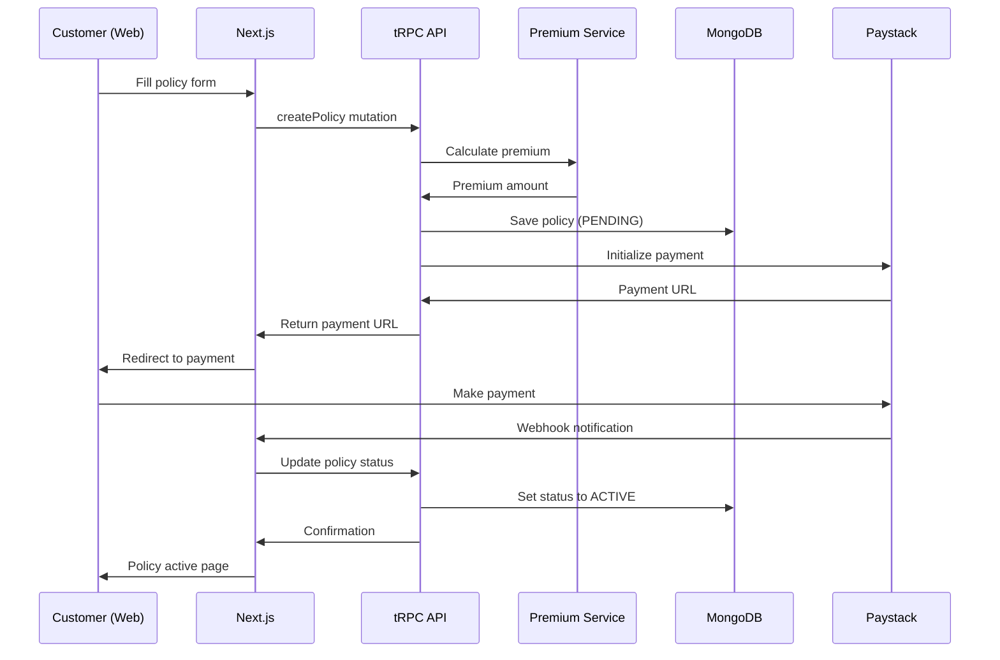
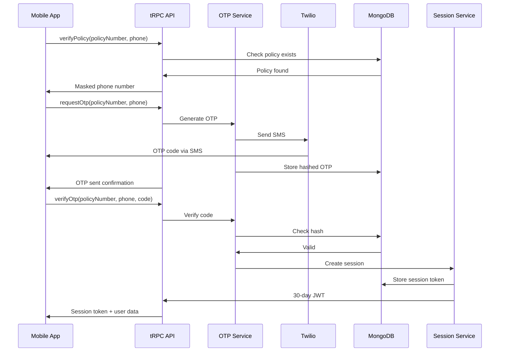

# Lalisure System Architecture

> **High-level overview** of the Lalisure Insurance Platform architecture, design patterns, and technology stack.

---

## 🏗️ Architecture Diagram



---

## 🎯 Core Architecture Principles

### 1. **Type-Safe Full Stack**
- TypeScript throughout (client + server)
- tRPC for end-to-end type safety
- Zod for runtime validation
- Prisma for type-safe database access

### 2. **Feature-Based Organization**
- Code organized by business features, not technical layers
- Colocated components, hooks, and utilities
- Clear separation of concerns

### 3. **Service Layer Pattern**
- Business logic encapsulated in service classes
- Reusable across API routes and server actions
- Easy to test and maintain

### 4. **Progressive Enhancement**
- Server-first rendering with Next.js
- Client-side interactivity where needed
- Optimistic updates for better UX

---

## 📦 Technology Stack

### Frontend
| Technology | Purpose | Version |
|------------|---------|---------|
| **Next.js** | React framework | 15.x |
| **React** | UI library | 19.x |
| **TypeScript** | Type safety | 5.x |
| **Tailwind CSS** | Styling | 4.x |
| **shadcn/ui** | Component library | Latest |
| **TanStack Query** | Server state | 5.x |
| **Zustand** | Client state | 4.x |
| **React Hook Form** | Forms | 7.x |
| **Zod** | Validation | 3.x |

### Backend
| Technology | Purpose | Version |
|------------|---------|---------|
| **tRPC** | Type-safe API | 11.x |
| **Prisma** | ORM | 5.x |
| **MongoDB** | Database | 6.x |
| **Next.js API Routes** | API endpoints | 15.x |

### External Services
| Service | Purpose | Integration |
|---------|---------|-------------|
| **Clerk** | Customer authentication | SDK + Webhooks |
| **Paystack** | Payment processing | REST API |
| **Twilio** | SMS (OTP codes) | REST API |
| **Resend** | Transactional email | SDK |
| **What3Words** | Rural addressing | REST API |
| **UploadThing** | File uploads | SDK |

---

## 🔄 Data Flow

### Customer Policy Creation Flow


### Mobile OTP Authentication Flow


---

## 🗂️ Directory Structure

```
src/
├── app/                          # Next.js 15 App Router
│   ├── (auth)/                   # Auth-related pages
│   ├── customer/                 # Customer portal
│   ├── staff/                    # Staff portal
│   ├── admin/                    # Admin dashboard
│   ├── agent/                    # Agent workflows
│   ├── api/                      # API routes
│   │   ├── trpc/[trpc]/         # tRPC handler
│   │   ├── webhooks/            # External webhooks
│   │   └── cron/                # Scheduled tasks
│   └── ...
│
├── components/                   # React components
│   ├── ui/                      # Base UI components
│   ├── forms/                   # Form components
│   ├── policies/                # Policy components
│   ├── claims/                  # Claims components
│   └── ...
│
├── lib/                         # Shared utilities
│   ├── auth/                    # Auth utilities
│   │   ├── staff-auth.ts        # Staff JWT auth
│   │   └── mobile-session.ts   # Mobile sessions
│   ├── services/                # Business logic
│   │   ├── otp.ts              # OTP generation
│   │   ├── premium-calculator.ts
│   │   ├── paystack.ts
│   │   ├── email.ts
│   │   └── sms.ts
│   ├── validations/             # Zod schemas
│   │   ├── policy.ts
│   │   ├── claim.ts
│   │   └── mobile-auth.ts
│   ├── utils/                   # Helper functions
│   └── db.ts                    # Database client
│
├── server/                      # tRPC server
│   └── api/
│       ├── root.ts              # Root router
│       └── routers/             # Feature routers
│           ├── policy.ts
│           ├── claim.ts
│           ├── mobile-auth.ts
│           └── ...
│
└── middleware.ts                # Next.js middleware
```

---

## 🔐 Authentication Architecture

### Multi-Auth Strategy

**Customer Portal (Web)**:
- **Provider**: Clerk
- **Method**: Email/password + social login
- **Session**: Clerk-managed JWT cookies
- **Duration**: 7 days (configurable)

**Mobile App**:
- **Provider**: Custom OTP system
- **Method**: Policy number + phone verification
- **Session**: Custom JWT + database
- **Duration**: 30 days (rural-optimized)

**Staff Portal (Web)**:
- **Provider**: Custom JWT system
- **Method**: Email/password
- **Session**: HTTP-only cookies
- **Duration**: 24 hours

### Auth Middleware Flow
```typescript
// middleware.ts
export async function middleware(request: NextRequest) {
  const path = request.nextUrl.pathname;

  // Customer routes: Check Clerk session
  if (path.startsWith('/customer')) {
    return clerkMiddleware(request);
  }

  // Mobile API: Check JWT token
  if (path.startsWith('/api/mobile')) {
    return mobileAuthMiddleware(request);
  }

  // Staff routes: Check staff JWT
  if (path.startsWith('/staff') || path.startsWith('/admin')) {
    return staffAuthMiddleware(request);
  }

  return NextResponse.next();
}
```

---

## 💾 Database Design

### Schema Overview
- **User**: Central entity for all users
- **Policy**: Insurance policies
- **Claim**: Insurance claims
- **Payment**: Payment records
- **Notification**: Multi-channel notifications
- **Email**: Email tracking
- **SecurityEvent**: Audit logs

### Key Relationships
```
User (1) ----< (M) Policy
User (1) ----< (M) Claim
Policy (1) ----< (M) Claim
Policy (1) ----< (M) Payment
User (1) ----< (M) Notification
User (1) ----< (M) SecurityEvent
```

See [Database Schema](./database-schema.md) for complete details.

---

## 🔄 State Management

### Server State (TanStack Query)
- API data caching
- Background refetching
- Optimistic updates
- Automatic retry

### Client State (Zustand)
- UI state (modals, drawers)
- Form state (multi-step forms)
- User preferences
- Transient data

### URL State (Next.js Router)
- Search parameters
- Route parameters
- Query strings
- Navigation state

---

## 🚀 Performance Optimizations

### Server-Side
- **Database Indexing**: Optimized queries
- **Connection Pooling**: Prisma connection pool
- **Caching**: Redis for session data
- **Lazy Loading**: Dynamic imports

### Client-Side
- **Code Splitting**: Automatic with Next.js
- **Image Optimization**: Next.js Image component
- **Prefetching**: Link prefetching
- **React Suspense**: Streaming SSR

---

## 🛡️ Security Architecture

### Layers of Security
1. **Network**: HTTPS, CORS, CSP headers
2. **Authentication**: Multi-provider auth
3. **Authorization**: Role-based access control
4. **Input Validation**: Zod schemas
5. **Data Protection**: Encryption at rest
6. **Monitoring**: Security event logging

See [Security Design](./security.md) for complete details.

---

## 📊 Monitoring & Analytics

### Application Monitoring
- **Error Tracking**: Sentry integration
- **Performance**: Core Web Vitals
- **Uptime**: Health check endpoints
- **Logs**: Structured logging

### Business Analytics
- **User Behavior**: PostHog
- **Payment Metrics**: Paystack dashboard
- **Email Analytics**: Resend dashboard
- **Custom Events**: Admin analytics

---

## 🔄 Deployment Architecture

### Production Environment
```
┌─────────────────────────────────────────┐
│           Load Balancer/CDN             │
│              (Render/Vercel)            │
└─────────────────┬───────────────────────┘
                  │
        ┌─────────┴──────────┐
        │                    │
   ┌────▼────┐         ┌────▼────┐
   │ Next.js │         │ Next.js │
   │ Instance│         │ Instance│
   └────┬────┘         └────┬────┘
        │                    │
        └─────────┬──────────┘
                  │
          ┌───────▼────────┐
          │  MongoDB Atlas │
          │    (Cluster)   │
          └────────────────┘
```

### Deployment Platforms
- **Primary**: Render (full-stack)
- **Alternative**: Vercel (frontend) + separate API
- **Database**: MongoDB Atlas (managed)
- **CDN**: Cloudflare or built-in

---

## 🔮 Future Architecture Considerations

### Planned Enhancements
- **Microservices**: Split into smaller services
- **Message Queue**: Background job processing
- **GraphQL**: Alternative API layer
- **Mobile Native**: React Native app
- **AI/ML**: Claims automation

---

## 📚 Related Documentation

- [Database Schema](./database-schema.md) - Complete database design
- [Authentication Flow](./authentication-flow-security-analysis.md) - Auth details
- [Security Design](./security.md) - Security architecture
- [Project Breakdown](./project_breakdown.md) - Detailed breakdown
- [Flowcharts](./FLOWCHARTS.md) - Visual diagrams

---

**Last Updated**: October 14, 2025
**Architecture Version**: 2.0
**Status**: Active Development
