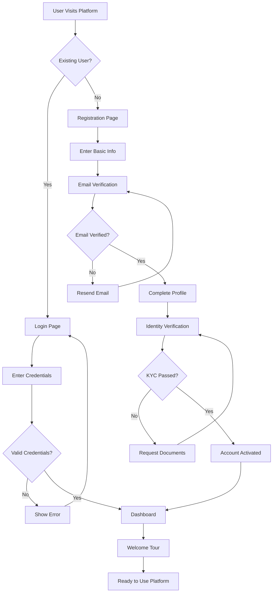
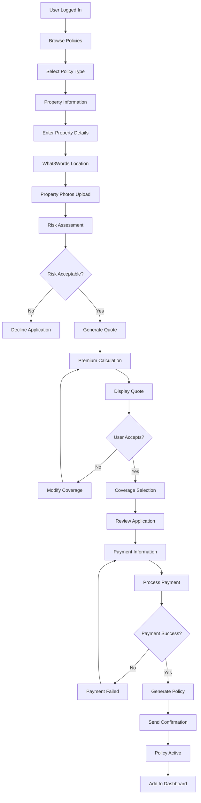
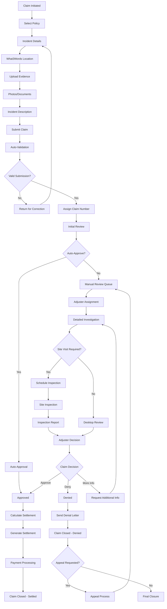
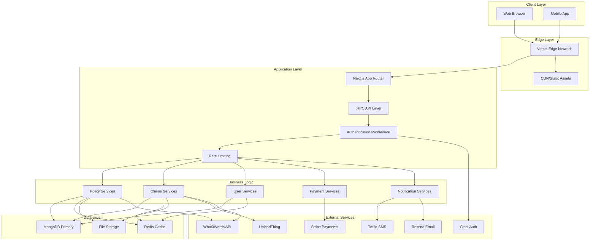
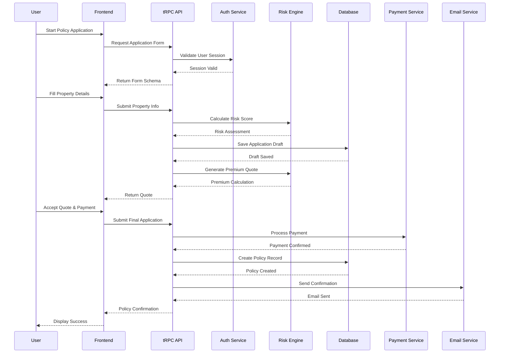
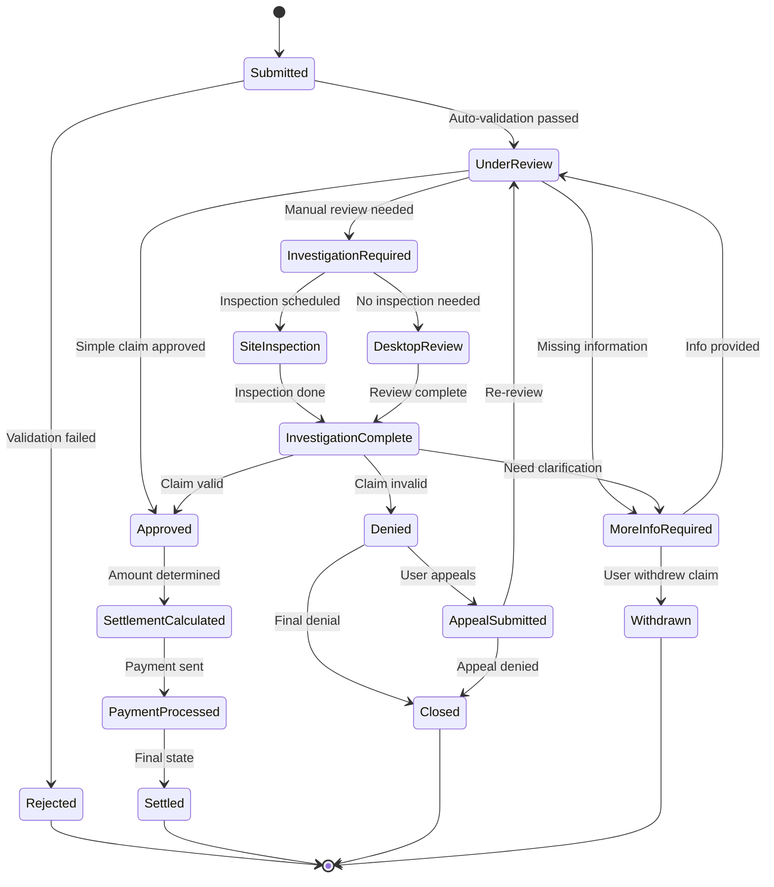
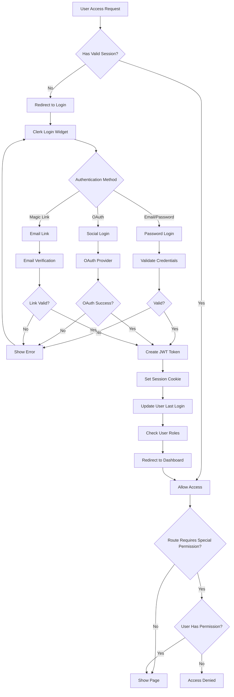
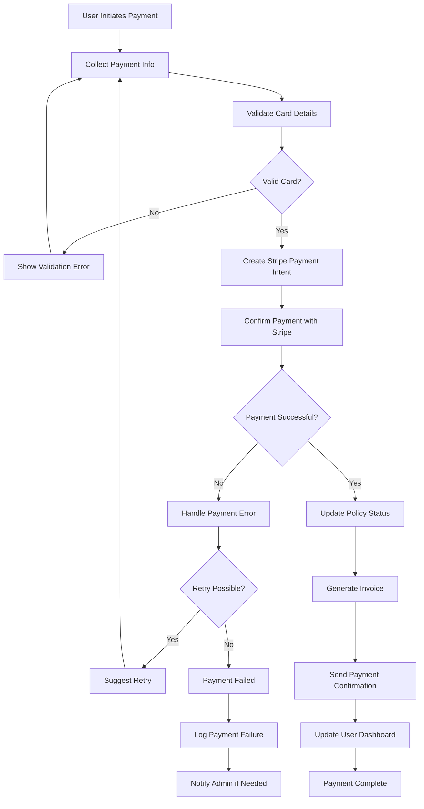

# Insurance Platform Flowcharts

## 1. User Registration & Onboarding Flow

## 2. Policy Purchase Journey

## 3. Claims Processing Workflow

## 4. System Architecture Flow

## 5. Data Flow for Policy Creation

## 6. Claims Status Tracking Flow

## 7. User Authentication Flow

## 8. Payment Processing Flow

## How to Use These Flowcharts

1. **View in GitHub/VS Code**: These Mermaid diagrams render automatically in GitHub and VS Code with Mermaid extensions
2. **Export as Images**: Use Mermaid CLI or online tools to export as PNG/SVG
3. **Documentation**: Reference these in technical specifications and user manuals
4. **Development Guide**: Use during implementation to ensure all scenarios are covered
5. **Testing**: Create test cases based on these flows to ensure comprehensive coverage

## Tools for Viewing/Editing

- **VS Code Extension**: Mermaid Markdown Syntax Highlighting
- **Online Editor**: https://mermaid.live/
- **CLI Tool**: `npm install -g @mermaid-js/mermaid-cli`
- **GitHub**: Native rendering in README files