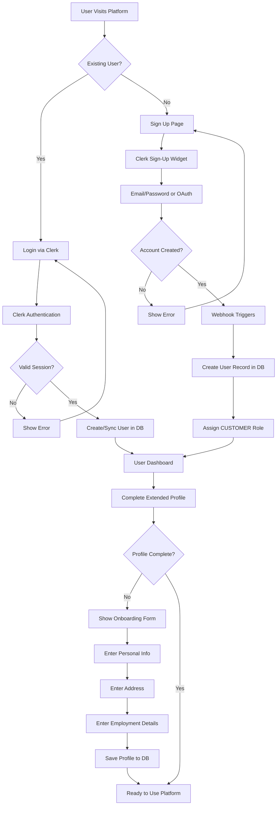
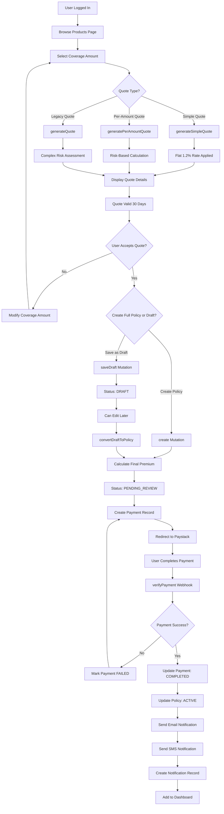
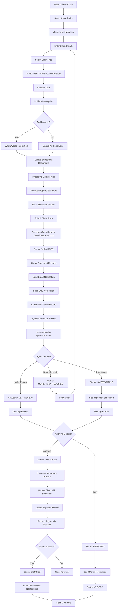
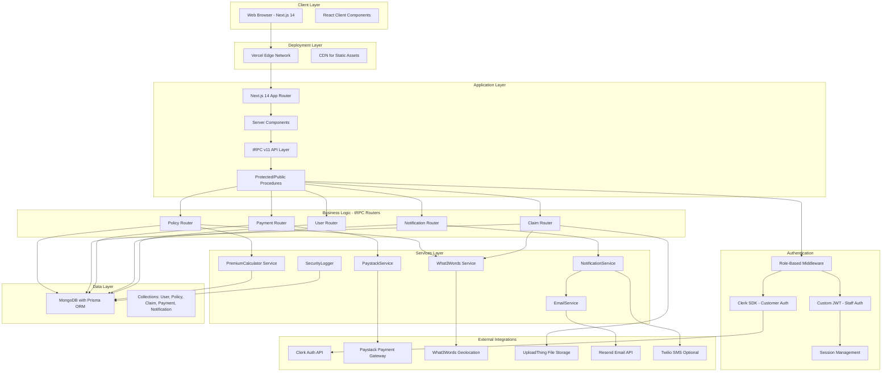
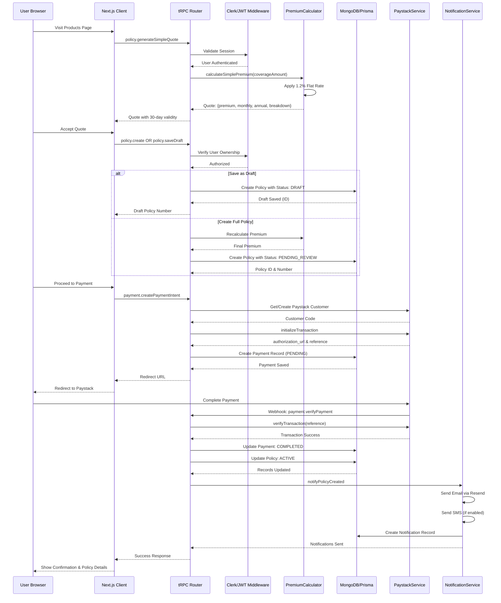
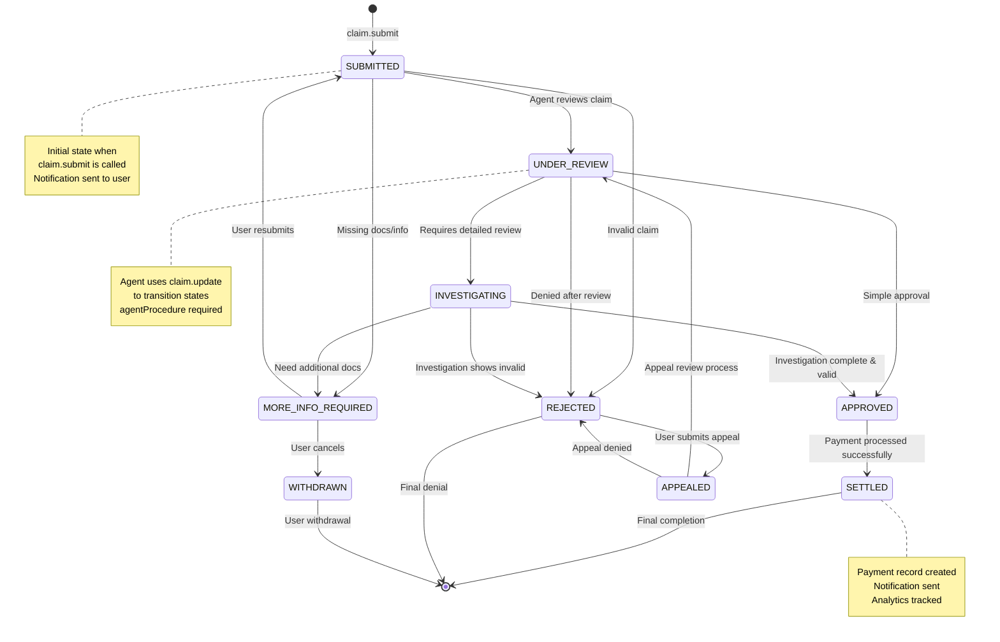

# Insurance Platform Flowcharts

## 1. User Registration & Onboarding Flow



## 2. Policy Purchase Journey



## 3. Claims Processing Workflow



## 4. System Architecture Flow



## 5. Data Flow for Policy Creation



## 6. Claims Status Tracking Flow (Current Implementation)



## 7. User Authentication Flow (Dual Auth System)

```mermaid
flowchart TD
    A[User Access Request] --> B{User Type?}

    B -->|Customer| C[Clerk Authentication]
    B -->|Staff| D[Staff Login Page]

    C --> E[Clerk Session Check]
    E --> F{Valid Clerk Session?}
    F -->|No| G[Redirect to /sign-in]
    F -->|Yes| H[Clerk Webhook Triggers]

    G --> I[Clerk Login Widget]
    I --> J[Email/Password or OAuth]
    J --> K{Auth Success?}
    K -->|No| L[Show Error] --> I
    K -->|Yes| H

    H --> M[Create/Update User in DB]
    M --> N[Assign Role: CUSTOMER]
    N --> O[Set Clerk Session]
    O --> P[Create tRPC Context]

    D --> Q[Enter Email/Password]
    Q --> R[POST /api/staff/login]
    R --> S[Verify Credentials with bcrypt]
    S --> T{Valid Credentials?}
    T -->|No| U[Return Error] --> D
    T -->|Yes| V[Generate JWT Token]

    V --> W[Set HttpOnly Cookie]
    W --> X[Create tRPC Context with JWT]

    P --> Y[tRPC Middleware Validation]
    X --> Y

    Y --> Z{Route Protection Level?}
    Z -->|Public| AA[Allow Access]
    Z -->|Protected| AB[protectedProcedure]
    Z -->|Agent| AC[agentProcedure]
    Z -->|Admin| AD[adminProcedure]

    AB --> AE{User Role >= CUSTOMER?}
    AC --> AF{User Role >= AGENT?}
    AD --> AG{User Role >= ADMIN?}

    AE -->|Yes| AA
    AE -->|No| AH[Throw UNAUTHORIZED]

    AF -->|Yes| AA
    AF -->|No| AH

    AG -->|Yes| AA
    AG -->|No| AH

    AA --> AI[Execute Request]
    AH --> AJ[Return 401 Error]

    note right of P
        Clerk provides:
        - User ID
        - Email
        - Role from metadata
    end note

    note right of X
        JWT contains:
        - User ID
        - Email
        - Role
        - Expiration
    end note
```

## 8. Payment Processing Flow (Paystack Integration)

```mermaid
flowchart TD
    A[User Ready to Pay] --> B[payment.createPaymentIntent]
    B --> C[Verify Policy Ownership]
    C --> D{User owns Policy?}
    D -->|No| E[Throw Error: Unauthorized]
    D -->|Yes| F{Paystack Customer Exists?}

    F -->|No| G[PaystackService.createCustomer]
    F -->|Yes| H[Get Customer Code]

    G --> I[Store paystackCustomerId in DB]
    I --> H

    H --> J[PaystackService.initializeTransaction]
    J --> K[Paystack API Returns]
    K --> L[authorization_url & reference]

    L --> M[Create Payment Record in DB]
    M --> N[Status: PENDING]
    N --> O[Return authorization_url to Client]

    O --> P[Redirect User to Paystack]
    P --> Q[User Enters Card Details]
    Q --> R[Paystack Processes Payment]

    R --> S{Payment Success?}
    S -->|No| T[Paystack Returns Error]
    S -->|Yes| U[Paystack Redirects to callback_url]

    T --> V[Show Payment Failed Message]
    V --> W[Allow Retry] --> P

    U --> X[payment.verifyPayment]
    X --> Y[PaystackService.verifyTransaction]
    Y --> Z{Transaction Verified?}

    Z -->|No| AA[Throw Error: Payment not successful]
    Z -->|Yes| AB[Update Payment: COMPLETED]

    AB --> AC[Set paidAt Timestamp]
    AC --> AD[Update Policy: ACTIVE if applicable]
    AD --> AE[NotificationService.notifyPaymentConfirmed]

    AE --> AF[Send Email via Resend]
    AF --> AG[Send SMS if enabled]
    AG --> AH[Create Notification Record]

    AH --> AI[Track Analytics Event]
    AI --> AJ[Return Success to Client]

    AJ --> AK[Show Success Message]
    AK --> AL[Update Dashboard UI]

    AA --> AM[Log Payment Verification Failure]
    AM --> AN[Show Error to User]

    note right of J
        Paystack transaction includes:
        - Amount in kobo (x100)
        - User email
        - Policy metadata
        - Callback URL
    end note

    note right of Y
        Verification checks:
        - Transaction status
        - Amount matches
        - User owns payment
    end note

    note right of AE
        Notification includes:
        - Policy number
        - Amount paid
        - Payment method
        - Receipt details
    end note
```

## 9. Notification System Flow

```mermaid
flowchart TD
    A[System Event Occurs] --> B{Event Type?}

    B -->|Policy Created| C[notifyPolicyCreated]
    B -->|Claim Submitted| D[notifyClaimSubmitted]
    B -->|Claim Status Change| E[notifyClaimStatusUpdate]
    B -->|Payment Confirmed| F[notifyPaymentConfirmed]
    B -->|Generic| G[sendNotification]

    C --> H[Check User Preferences]
    D --> H
    E --> H
    F --> H
    G --> H

    H --> I[Get notificationPreferences from DB]
    I --> J{Email Enabled?}
    J -->|Yes| K[EmailService.sendTrackedEmail]
    J -->|No| L[Skip Email]

    K --> M[Resend API Call]
    M --> N[Create Email Log in DB]

    I --> O{SMS Enabled?}
    O -->|Yes| P[Twilio SMS Service]
    O -->|No| Q[Skip SMS]

    P --> R[Send SMS]
    R --> S[Log SMS Delivery]

    I --> T{Push Enabled?}
    T -->|Yes| U[Create Notification Record]
    T -->|No| V[Skip Push]

    U --> W[notification.create in DB]
    W --> X[Set read: false]

    L --> Y[Complete Notification Flow]
    Q --> Y
    V --> Y
    N --> Y
    S --> Y
    X --> Y

    Y --> Z[Return Success]

    note right of H
        User preferences control:
        - Email notifications
        - SMS notifications
        - Push notifications
        - Category-specific settings
    end note

    note right of U
        In-app notifications shown in:
        - Notification bell icon
        - Dashboard alerts
        - Real-time updates
    end note
```

## 10. Role-Based Access Control Flow

```mermaid
flowchart TD
    A[API Request] --> B[tRPC Context Creation]
    B --> C{Auth Type?}

    C -->|Clerk| D[Extract Clerk User ID]
    C -->|JWT| E[Verify JWT Token]
    C -->|None| F[Public Access]

    D --> G[Fetch User from DB]
    E --> G

    G --> H{User Found?}
    H -->|No| I[Throw UNAUTHORIZED]
    H -->|Yes| J[Extract User Role]

    J --> K{Procedure Type?}

    K -->|publicProcedure| L[Allow - No Auth Required]
    K -->|protectedProcedure| M{Role >= CUSTOMER?}
    K -->|agentProcedure| N{Role >= AGENT?}
    K -->|adminProcedure| O{Role >= ADMIN?}

    M -->|Yes| P[Execute Handler]
    M -->|No| I

    N -->|Yes| P
    N -->|No| I

    O -->|Yes| P
    O -->|No| I

    F --> L
    L --> P

    P --> Q[Access Business Logic]
    I --> R[Return 401 Error]

    note right of J
        Role Hierarchy:
        1. CUSTOMER (lowest)
        2. AGENT
        3. UNDERWRITER
        4. ADMIN (highest)
    end note

    note right of Q
        Additional checks in handlers:
        - Resource ownership
        - Policy ownership
        - Claim ownership
    end note
```

## 11. Admin Bulk Operations Flow

```mermaid
flowchart TD
    A[Admin Dashboard] --> B{Bulk Operation Type?}

    B -->|Approve Policies| C[policy.bulkApprove]
    B -->|Expire Policies| D[policy.bulkExpire]
    B -->|Send Renewals| E[policy.bulkRenewal]
    B -->|Audit Policies| F[policy.bulkAudit]
    B -->|Recalculate Premiums| G[policy.bulkRecalculate]
    B -->|Update User Roles| H[user.bulkUpdateRole]
    B -->|Activate/Deactivate Users| I[user.bulkActivate]
    B -->|Send Invitations| J[user.bulkInvite]

    C --> K[Verify adminProcedure]
    D --> K
    E --> K
    F --> K
    G --> K
    H --> K
    I --> K
    J --> K

    K --> L{Admin Authorized?}
    L -->|No| M[Return 403 Forbidden]
    L -->|Yes| N[Process Batch]

    N --> O[For Each Selected Item]
    O --> P[Validate Item State]
    P --> Q{Valid for Operation?}

    Q -->|No| R[Skip Item - Log Error]
    Q -->|Yes| S[Perform Operation]

    S --> T{Operation Type?}
    T -->|Status Update| U[Update DB Status]
    T -->|Notification| V[Send Notification]
    T -->|Calculation| W[Recalculate Values]
    T -->|Audit| X[Generate Report]

    U --> Y[Log Security Event]
    V --> Y
    W --> Y
    X --> Y

    Y --> Z[SecurityLogger.logSystemAccess]
    Z --> AA[Record Admin Action]

    R --> AB[Collect Results]
    AA --> AB

    AB --> AC{All Items Processed?}
    AC -->|No| O
    AC -->|Yes| AD[Return Summary]

    AD --> AE[Success Count]
    AE --> AF[Failure Count]
    AF --> AG[Detailed Results]

    note right of Z
        Security logging captures:
        - Admin user ID & email
        - Operation type
        - Affected resource IDs
        - Timestamp
        - IP address
        - User agent
    end note

    note right of N
        Bulk operations limited to:
        - Max 10-100 items per batch
        - Transaction safety
        - Error recovery
    end note
```

## 12. Premium Calculation Strategies

```mermaid
flowchart TD
    A[Quote Request] --> B{Calculation Method?}

    B -->|Simple| C[calculateSimplePremium]
    B -->|Per Amount| D[calculatePremiumPerAmount]
    B -->|Legacy Complex| E[calculatePremium]

    C --> F[Flat 1.2% Rate]
    F --> G[coverageAmount * 0.012]
    G --> H[Monthly: premium / 12]
    H --> I[Return Quote]

    D --> J[Base Rate by Policy Type]
    J --> K{Risk Factors Provided?}
    K -->|Yes| L[Apply Risk Multipliers]
    K -->|No| M[Use Base Rate Only]

    L --> N[Location Risk Adjustment]
    N --> O[Demographics Adjustment]
    O --> P[Property Features Adjustment]
    P --> Q[Personal History Adjustment]

    Q --> R[Deductible Discount]
    R --> S[Calculate Final Premium]

    M --> S

    E --> T[Complex Multi-Factor Model]
    T --> U[Coverage Breakdown]
    U --> V[Dwelling Coverage]
    V --> W[Personal Property]
    W --> X[Liability Coverage]

    X --> Y[Risk Factor Analysis]
    Y --> Z[Location Risk: Province + Postal]
    Z --> AA[Demographics: Age]
    AA --> AB[Property: Year, Type, Features]
    AB --> AC[Personal: Credit + Claims History]

    AC --> AD[Aggregate Risk Score]
    AD --> AE[Apply to Each Coverage Type]
    AE --> AF[Sum All Coverages]
    AF --> AG[Apply Deductible Adjustment]

    S --> I
    AG --> I

    I --> AH[Add Breakdown Details]
    AH --> AI[Generate Quote Number]
    AI --> AJ[Set 30-Day Validity]
    AJ --> AK[Return to Client]

    note right of F
        Simple Model:
        - Same rate for all customers
        - No discrimination
        - Easy to understand
        - LaLiSure's current approach
    end note

    note right of L
        Risk Multipliers:
        - Crime rate: 0.9-1.15x
        - Natural disaster: 0.95-1.2x
        - Age: 0.95-1.1x
        - Property age: 0.9-1.15x
        - Claims history: 0.9-1.3x
    end note

    note right of T
        Legacy Model:
        - Full risk assessment
        - Individual pricing
        - Complex calculations
        - Not currently used
    end note
```

## Implementation Notes

### Current Active Flows
1. **Simple Premium Calculation** - Primary method used in production
2. **Paystack Payment Processing** - All payments go through Paystack
3. **Clerk Customer Authentication** - Main auth for customers
4. **JWT Staff Authentication** - Separate auth for staff members
5. **Multi-channel Notifications** - Email (Resend) + SMS (Twilio) + In-app

### Key Integrations
- **Clerk**: Customer authentication, user management, webhooks
- **Paystack**: Payment processing, subscriptions, customer management
- **What3Words**: Precise geolocation for properties and claims
- **UploadThing**: File upload for documents and photos
- **Resend**: Transactional email delivery
- **Twilio**: SMS notifications (optional)

### Database Schema Highlights
- **User**: Stores both customer and staff accounts with role hierarchy
- **Policy**: Supports DRAFT, PENDING_REVIEW, ACTIVE, EXPIRED, CANCELLED states
- **Claim**: Tracks status from SUBMITTED to SETTLED with agent updates
- **Payment**: Links to Paystack with status tracking
- **Notification**: In-app notification center with read/unread status

### Security Features
- **Role-based access control** with 4 levels (CUSTOMER, AGENT, UNDERWRITER, ADMIN)
- **SecurityLogger** tracks all critical operations
- **Ownership validation** ensures users can only access their resources
- **JWT tokens** for staff with HttpOnly cookies
- **Clerk sessions** for customers with automatic sync

## How to Use These Flowcharts

1. **View in GitHub/VS Code**: These Mermaid diagrams render automatically in GitHub and VS Code with Mermaid extensions
2. **Export as Images**: Use Mermaid CLI or online tools to export as PNG/SVG
3. **Documentation**: Reference these in technical specifications and user manuals
4. **Development Guide**: Use during implementation to ensure all scenarios are covered
5. **Testing**: Create test cases based on these flows to ensure comprehensive coverage

## Tools for Viewing/Editing

- **VS Code Extension**: Mermaid Markdown Syntax Highlighting
- **Online Editor**: https://mermaid.live/
- **CLI Tool**: `npm install -g @mermaid-js/mermaid-cli`
- **GitHub**: Native rendering in README files